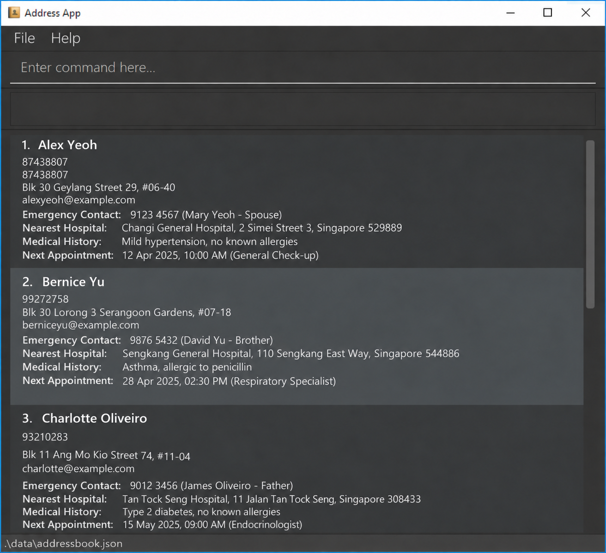

LaiNurse is a **desktop application that gives home nurses fast access to patient and appointment details for home visits, optimized for use through a Command Line Interface (CLI)** while retaining the benefits of a Graphical User Interface (GUI). If you type quickly, LaiNurse can help you look up and update patient details faster than traditional GUI applications.

* Table of Contents
{:toc}

--------------------------------------------------------------------------------------------------------------------

## Quick start

1. Ensure that Java `25` or later is installed on your computer. 
   **Mac users:** Ensure you have the precise JDK version prescribed [here](https://se-education.org/guides/tutorials/javaInstallationMac.html).

1. Download the latest `.jar` file from [here](https://github.com/AY2627S1-CS2103T-F08-2/tp/releases).

1. Copy the file to the folder you want to use as the _home folder_ for LaiNurse.

1. Open a terminal, `cd` to the folder containing the JAR file, and run `java -jar addressbook.jar`. 
   LaiNurse keeps its data in the folder you launch it from, so always launch it from this folder. 
   A GUI similar to the one below should appear in a few seconds. Note how the app contains some sample data. 
   

1. Type a command in the command box and press Enter to execute it. For example, type **`help`** and press Enter to open the help window. 
   Some example commands you can try:

   * `list` : Lists all patients.

   * `add --id T0123456B --name John Doe --number 98765432 --address John street, block 123, #01-01` : Adds a patient named `John Doe` with the ID `T0123456B`.

   * `delete S1234567A` : Deletes the patient with the ID `S1234567A` (Alex Yeoh, in the sample data).

   * `clear` : Deletes all patients.

   * `exit` : Exits the app.

1. Refer to the [Features](#features) section below for details of each command.

--------------------------------------------------------------------------------------------------------------------

## Features

**:information_source: Notes about the command format:** 

* Words in `UPPER_CASE` are the parameters to be supplied by the user. 
  For example, in `add --name NAME`, replace `NAME` with a value such as `John Doe`.

* Items in square brackets are optional. 
  For example, `--name NAME [--medical-history MEDICAL_HISTORY]` can be used as `--name John Doe --medical-history Asthma` or as `--name John Doe`.

* Items followed by `…`​ can appear zero or more times. 
  For example, `[KEYWORD]…​` may be omitted, or written as `John` or `John Jane`.

* Parameters can be in any order. 
  For example, if the command specifies `--name NAME --number NUMBER`, `--number NUMBER --name NAME` is also acceptable.

* Extraneous parameters for commands that take no parameters, such as `help`, `list`, `exit`, and `clear`, are ignored. 
  For example, `help 123` is interpreted as `help`.

* If you are using a PDF version of this document, be careful when copying and pasting commands that span multiple lines as space characters surrounding line-breaks may be omitted when copied over to the application.

### Viewing help: `help`

Opens a window with a link to this user guide.

Format: `help`

### Adding a patient: `add`

Adds a patient to LaiNurse.

Format: `add --id ID --name NAME --number NUMBER --address ADDRESS [--medical-history MEDICAL_HISTORY] [--next-appointment DATE_OR_DATETIME]`

* `--id`, `--name`, `--number`, and `--address` are required. Each must have a non-blank value.
* Medical history and next appointment are independently optional. If an option is supplied, its value must not be blank.
* Parameters may appear in any order, and each option may appear only once. Separate options and values using spaces or tabs; values may contain spaces.
* IDs contain 1 to 10 letters or digits. IDs are case-insensitive, and a patient with an existing ID cannot be added again.
* Names, addresses, and medical history accept any non-blank text. IDs and these text fields are stored in uppercase, with repeated whitespace collapsed.
* Phone numbers may contain digits, spaces, `+`, and `-`, and must contain at least three digits.
* Next appointment must be a real date in `yyyy-MM-dd` format, optionally followed by a 24-hour time in `HH:mm` format, such as `2026-11-30` or `2026-11-30 09:00`. Past dates are accepted.
* Whitespace-delimited words beginning with `--` are reserved for options, including within text fields. Unknown options, misspellings, and `--name=value` syntax are rejected with the command usage instructions.
* After a patient is added, the list shows all patients again, even if it was showing `find` results. The list numbers of other patients may change.

Examples:

* `add --id T0123456B --name John Doe --number 98765432 --address John street, block 123, #01-01`
* `add --medical-history Asthma --address Block 312, Clementi Ave 2 --number 91234567 --name Betsy Crowe --id S2222222B --next-appointment 2026-11-30`
* `add --next-appointment 2026-11-30 09:00 --name James Ho --id S3333333C --address 123, Clementi Rd, 1234665 --number 22224444`

### Listing all patients: `list`

Shows a list of all patients, with each patient's ID, name, phone number and address.
Medical history and next appointment are shown only if the patient has them.

Format: `list`

### Editing a patient: `edit`

Edits an existing patient in the address book.

Format: `edit ID [n/NAME] [p/PHONE] [e/EMAIL] [a/ADDRESS] [t/TAG]…​`

* Edits the patient at the specified `ID`. The ID refers to the ID number shown in the displayed patient list. The ID **must be a positive integer** 1, 2, 3, …​
* At least one of the optional fields must be provided.
* Existing values will be updated to the input values.
* When editing tags, all of the patient's existing tags are removed; adding tags is not cumulative.
* To remove all of a patient's tags, enter `t/` without a tag after it.

Examples:
*  `edit 1 p/91234567 e/johndoe@example.com` Edits the phone number and email address of the 1st patient to be `91234567` and `johndoe@example.com` respectively.
*  `edit 2 n/Betsy Crower t/` Edits the name of the 2nd patient to be `Betsy Crower` and clears all existing tags.

### Locating patients by name: `find`

Finds patients whose names contain any of the given keywords.

Format: `find KEYWORD [MORE_KEYWORDS]`

* The search is case-insensitive; for example, `hans` matches `Hans`.
* Keyword order does not matter; for example, `Hans Bo` matches `Bo Hans`.
* The search considers only names.
* Only full words match; for example, `Han` does not match `Hans`.
* patients matching at least one keyword are returned (an `OR` search); for example, `Hans Bo` returns `Hans Gruber` and `Bo Yang`.

Examples:
* `find John` returns `john` and `John Doe`
* `find alex david` returns `Alex Yeoh`, `David Li` 
  

### Viewing appointments: `viewappt`

Views patients who have appointments on the specified date.

Format: `viewappt DATE`

* `DATE` must be a real date in `yyyy-MM-dd` format.
* The date range is inclusive (views appointments on that specific date).
* Only patients with appointments on the specified date are shown.
* If no patients have appointments on that date, an empty list is shown.

Examples:
* `viewappt 2026-10-15` views all patients with appointments on October 15, 2026.
* `viewappt 2026-12-25` views all patients with appointments on December 25, 2026.

### Deleting a patient: `delete`

Deletes the specified patient from LaiNurse.

Format: `delete ID`

* Deletes the patient with the specified `ID`. IDs are case-insensitive, so `s1234567a` and `S1234567A` refer to the same patient.
* The patient does not need to be in the displayed list, because `delete` searches all patients.
* If no patient has that ID, LaiNurse shows an error and deletes nothing.
* The displayed list keeps its current filter, so the list numbers of the patients below the deleted one go down by one.

Examples:
* `delete S1234567A` deletes the patient with the ID `S1234567A`.

### Deleting all patients: `clear`

Deletes all patients from LaiNurse. This cannot be undone.

Format: `clear`

### Exiting the program: `exit`

Exits the program.

Format: `exit`

### Saving the data

LaiNurse saves your data automatically after every command that succeeds. You do not need to save manually.

### Editing the data file

LaiNurse saves its data as a JSON file, `data/addressbook.json`, inside the folder you launched it from. If you followed the [Quick start](#quick-start), that is the folder containing the JAR file. Advanced users are welcome to update data directly by editing that data file.

:exclamation: **Caution:**
If your changes make the data file invalid, LaiNurse starts with an empty patient list the next time it launches. The next command that succeeds, even `list` or `help`, then overwrites the invalid file with the empty list, and the data in it is lost. Back up the file before you edit it. If LaiNurse starts empty after an edit, close the window without running any command (the `exit` command also saves), and restore your backup. 
Furthermore, certain edits can cause LaiNurse to behave in unexpected ways (e.g., if a value entered is outside of the acceptable range). Therefore, edit the data file only if you are confident that you can update it correctly.

--------------------------------------------------------------------------------------------------------------------

## FAQ

**Q**: How do I transfer my data to another computer? 
**A**: Install LaiNurse on the other computer. Then copy `data/addressbook.json` from your old LaiNurse home folder into a `data` folder next to the JAR file on the new computer, replacing the file there if there is one.

--------------------------------------------------------------------------------------------------------------------

## Known issues

1. **When using multiple screens**, if you move the application to a secondary screen, and later switch to using only the primary screen, the GUI will open off-screen. The remedy is to delete the `preferences.json` file created by the application before running the application again.
2. **If you minimize the Help Window** and then run the `help` command (or use the `Help` menu, or the keyboard shortcut `F1`) again, the original Help Window will remain minimized, and no new Help Window will appear. The remedy is to manually restore the minimized Help Window.

--------------------------------------------------------------------------------------------------------------------

## Command summary

Action | Format, Examples
--------|------------------
**Add** | `add --id ID --name NAME --number NUMBER --address ADDRESS [--medical-history MEDICAL_HISTORY] [--next-appointment DATE_OR_DATETIME]`   e.g., `add --id S3333333C --name James Ho --number 22224444 --address 123, Clementi Rd, 1234665 --next-appointment 2026-11-30 09:00`
**Clear** | `clear`
**Delete** | `delete ID`  e.g., `delete T0123456B`
**Edit** | `edit ID [n/NAME] [p/PHONE_NUMBER] [e/EMAIL] [a/ADDRESS] [t/TAG]…​`  e.g., `edit 2 n/James Lee e/jameslee@example.com`
**Find** | `find KEYWORD [MORE_KEYWORDS]`  e.g., `find James Jake`
**List** | `list`
**ViewAppt** | `viewappt DATE`  e.g., `viewappt 2026-10-15`
**Help** | `help`
**Exit** | `exit`
